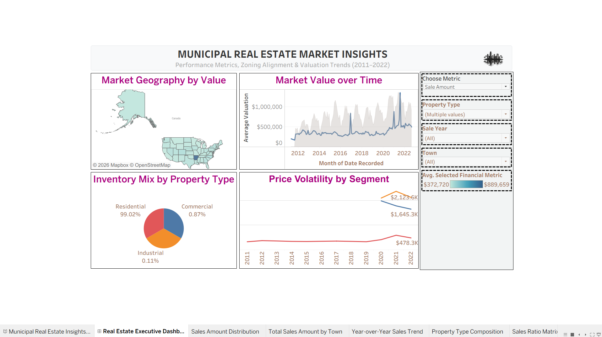
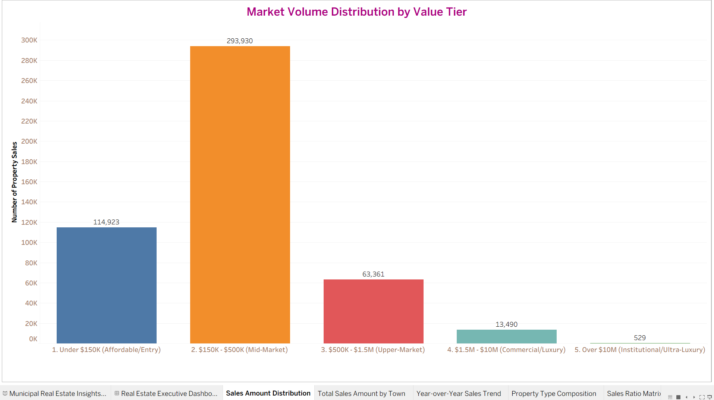
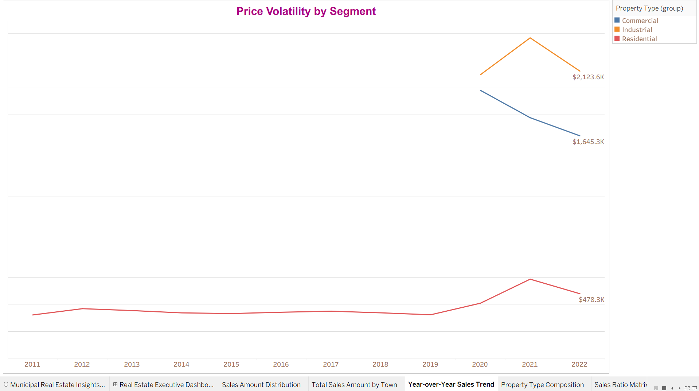
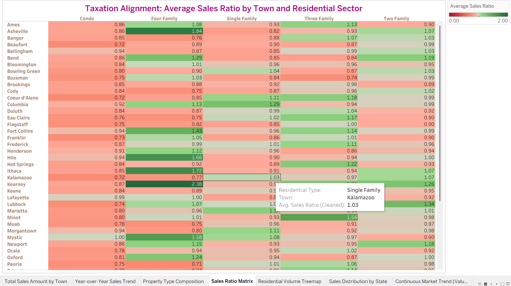

# Municipal Real Estate Market Insights and Analytics
### Real Estate Sales Analysis and Sales Ratio Auditing (2011-2022)

---

## Project Overview
This project analyzes a dataset of 10,000 real estate transactions from 2011 to 2022 across multiple municipalities. The analysis tracks overall market trends to understand price changes over time.

### Key Insights:
* **Market Trends:** Real estate prices peaked in late 2021 with average prices hitting over $1.36M. Prices went through a sharp correction during 2022 and began stabilizing around a $500K baseline by early 2023.
* **Geographic Trends:** Real estate volume is highly concentrated in specific regions. A single municipality—Hot Springs, Arkansas—accounts for $8.61B in total transactional volume, showing a major gap compared to smaller areas.
* **Property Tax Assessment Gaps:** Property tax models show major gaps when comparing assessed values to actual sale prices. Multi-family homes face high over-assessment, peaking in Kearney with a ratio of 2.38. On the other hand, condos show under-assessment and cause tax revenue loss in areas like Salina (0.71 ratio) and Beaufort (0.72 ratio).

---

## Data Structure and Rules

### Applied Data Filters
To keep the data clean and remove outliers, two data source filters were applied to the workbook:
1. **Sale Amount ([Sale Amount (Cleaned)]):** Limited to values greater than or equal to $2,000. This removes internal family transfers, non-market sales, and empty data.
2. **Timeline ([Sale Year]):** Filtered to include exactly 12 years of data from 2011 to 2022 for consistent time-series tracking.

### Data Dictionary

| Field Name | Data Type | Role in Project |
| :--- | :--- | :--- |
| **Serial Number** | Integer | Unique identifier for each real estate transaction. |
| **List Year** | Integer | The year the property was listed for sale. |
| **Date Recorded** | Date | The date the sale was recorded; broken down by month and year. |
| **Town** | String | The municipality where the property is located. |
| **Property Type** | String | The general category of the property (Residential, Commercial, Industrial). |
| **Residential Type** | String | The specific housing type (Single Family, Condo, Four-Family, etc.). |
| **Assessed Value (Cleaned)** | Integer | The calculated municipal tax value, filtering out $0 fields. |
| **Sale Amount (Cleaned)** | Decimal | The calculated open-market sale price, filtering out $0 fields. |
| **Sales Ratio (Cleaned)** | Percentage | Calculated field: Assessed Value divided by Sale Amount, used to find tax assessment gaps. |

---

## Dashboard Views and Analysis

### 1. Market Value over Time and Location
Transaction volumes peaked in mid-2021. This sudden increase in demand caused average property prices to spike to over $1.36M by the end of 2021, followed by a steady price drop throughout 2022. The market remains highly polarized. While secondary hubs like Rehoboth Beach ($4.25B) and Asheville ($4.13B) show good activity, total sales volume is heavily concentrated in the top markets.

### 2. Property Type Composition and Price Volatility
The structural mix shows that standard residential housing makes up the vast majority of the market, accounting for 99.02% of all active inventory. Government records show that municipal assessed values stayed steady compared to volatile open-market prices, remaining in a stable range between $237,612 and $333,182 for most of the decade, before adjusting to a high of $478.3K in 2022. 

In contrast, commercial and industrial property segments experienced much higher pricing volatility, spiking sharply to peaks of $1,645.3K and $2,123.6K in 2021 before correcting down through 2022.

The transaction volume is also heavily concentrated in the mid-market segment. Properties priced between $150K and $500K represent the largest baseline share of the market with 293,930 transactions, followed by entry-level properties under $150K at 114,923 transactions. High-end segments taper off significantly, dropping to 63,361 for upper-market properties and 13,490 for luxury commercial or residential real estate.

### 3. Sales Ratio and Tax Assessment Auditing
The Sales Ratio matrix highlights property tax imbalances when compared to the 1.00 assessment target line. High-density family properties face a high tax burden due to over-assessment, with ratios peaking in Kearney at 2.38. Meanwhile, local governments lose tax revenue because condo assessments are too low compared to actual market values, notably in Salina (0.71) and Beaufort (0.72).

---

## Recommendations
* **Review Multi-Family Appraisal Disparities:** Investigate the high over-assessment patterns found in the multi-family sector—specifically in Kearney (2.38 ratio) and Tuscaloosa (2.28 ratio)—where assessed values are significantly higher than actual open-market sale prices.
* **Update Condo Assessment Baselines:** Update valuation models for condominium sectors in jurisdictions like Beaufort (0.72 ratio) and Kalamazoo (0.77 ratio) to pull lagging assessed values closer to parity with actual market sale amounts.
* **Segment Volatility Tracking:** Establish distinct, separate market monitoring schedules for commercial and industrial property segments, as their line trends show significantly higher price swings over time compared to the steady baseline found in the residential housing market.

